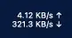
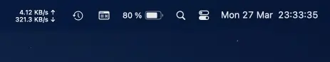

# mercanet

[](https://github.com/Mercandj/mercanet/releases)
[](https://www.apple.com/fr/swift/)
[](https://www.apple.com/macos)

## 1. Description

This is a menu bar app for Mac OS.

<a margin="20px 0 20px 40px" href="https://play.google.com/store/apps/details?id=com.mercandalli.android.browser">
	
</a>

<br /><br /><br /><br />



----

## 2. How to run the app

### 2.a. If you trust the app developer

- Download the latest zip
  version [from the latest release](https://github.com/Mercandj/mercanet/releases)
- Accept the Chrome warning about the fact the file is dangerous
- Unzip
- Right click (click with 2 fingers) on the `mercanet.app` file
- On the menu, click `Open`
- On the alert
  dialog `“mercanet.app” can’t be opened because Apple cannot check it for malicious software.`
  click `Ok`
- Enjoy the app on the Mac Menu bar

### 2.b. If you do not trust the app developer

- Read the code
- Be sure to have xode installed and `xcodebuild` available on your terminal
- Copy past the following lines in a mac terminal

```shell
# Get source code
git clone https://github.com/Mercandj/mercanet.git # Get the sources

# Build the code
pushd mercanet # Change directory to the sources code
xcodebuild -scheme mercanet build CONFIGURATION_BUILD_DIR=./build -configuration Release # Build the app 
popd # Go back to parent folder of mercanet folder 
cp ./mercanet/build/mercanet.app ./mercanet.app # Get the executable
rm -rf ./mercanet # Remove the project

# Open the app 
open ./mercanet.app # Open the app
```

----

## 3. How to make a new release of this repository

- Go to xcode and select the xcodeproj
- Select the target `mercanet[readme.md][publish.sh](publish.sh)(readme.md[publish.sh](publish.sh))`
- Bump version and build
- Bump this readme label
- Commit `[Version] Bump to X.YY.ZZ`
- Run `./publish.sh`
- Make a github [release](https://github.com/Mercandj/mercanet/releases) with
  the `./build/mercanet.zip`

----

## 4. Thanks to

This app is based on

- the [Up&Down](https://github.com/gjiazhe/Up-Down) app version 1.1
- the command line
  tool [nettop](https://developer.apple.com/legacy/library/documentation/Darwin/Reference/ManPages/man1/nettop.1.html).